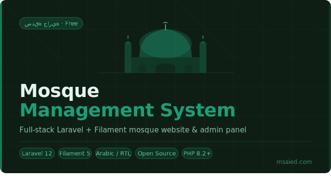

<p align="center">
  <a href="https://laravel.com"></a>
  <a href="https://filamentphp.com"></a>
  <a href="https://www.php.net"></a>
  <a href="https://pestphp.com"></a>
  
  
  
</p>

<h1 align="center">Mosque Management System</h1>

<p align="center">
  A full-stack Laravel & Filament application for mosque websites and operations — bilingual by default, infinitely extensible, and built as an act of ongoing charity.
</p>

---

## 🕌 About

A **complete, production-ready** mosque website and admin panel covering the full range of a mosque's digital needs: public website, prayer times, events, announcements, news, a flexible page builder, Islamic content library, media gallery, contact management, and a powerful multilingual admin panel.

> **This project is 100% free for the sake of Allah.**
>
> تم تنفيذ هذا المشروع بواسطة **المهندس محمد سعيد** — [msaied.com](https://msaied.com/)
>
> It is offered as an ongoing charity — **صدقة جارية** — for the Muslim community.
> Contributions, improvements, and forks are warmly welcomed.

---

## 🌍 Dynamic Language System

The system is built around a **fully dynamic, database-driven language architecture**. Languages are not hardcoded — they are managed entirely from the admin panel.

- **Add any language** at runtime without touching code or config files
- Ships with **Arabic and English pre-configured**, including full RTL/LTR layout switching
- Every content model uses **Spatie Laravel Translatable**, so all fields are translatable per language
- The **Filament admin panel switches language context** on the fly using `bezhansalleh/filament-language-switch`
- Translation strings are managed directly from the admin using `statikbe/laravel-filament-chained-translation-manager` — no `.php` file editing required
- Missing translations are detected during development via `coding-socks/lost-in-translation` and `eg-mohamed/laravelmissingtranslations`
- Translation tabs in forms are powered by `abdulmajeed-jamaan/filament-translatable-tabs`

> To add a new language (e.g. French or Urdu): go to the admin panel → Languages → Add Language. That's it.

---

## ✅ Test Coverage

The project ships with a **near-complete Pest 4 test suite** covering both the public frontend and the Filament admin panel.
````bash
php artisan test
# or
./vendor/bin/pest
````

- Tests are organized by section — frontend routes and admin resources each have their own test files
- Coverage spans public page rendering, form submissions, admin CRUD operations, and page builder blocks
- Uses `pestphp/pest-plugin-laravel` for Laravel-specific assertions and test helpers
- Dev tooling includes `laravel/boost` for enhanced test utilities and `nunomaduro/collision` for clean failure output
````
Tests:    ✓ passing (~100% coverage)
Duration: fast — all tests run against an in-memory SQLite database
````

---

## ✨ Features

### Public Website

| Section | Description |
|---|---|
| Home | Dynamic content blocks via page builder |
| Prayer Times | Daily and monthly schedules |
| Events | Upcoming programs and activities |
| Announcements | News and community notices |
| News | Category-based news archive with detail pages |
| Gallery | Media items with collection filters |
| Islamic Library | Quran verses and hadith archive |
| Jumu'ah Khutba | Khutba archive with category filters and detail pages |
| Staff | Scholar and team member profiles |
| Contact | Live contact form with Google Maps embed |
| Custom Pages | Flexible page builder with reusable blocks |

### Admin Panel

- Dashboard with mosque settings
- Full CRUD for all content sections
- Dedicated management for news, news categories, khutbas, and khutba categories
- Page builder with 20+ block types
- Home page toggle for pages that forces `home` slug, published state, and navigation visibility
- Prayer time management (daily and monthly)
- Language management — add/remove languages from the UI
- Translation manager — edit all translation strings from the admin panel
- Contact submission inbox
- Phone input with country picker (`ysfkaya/filament-phone-input`)
- Map picker for mosque location (`salemaljebaly/filament-map-picker`)
- Font Awesome icons via Blade components (`owenvoke/blade-fontawesome`)

### Page Builder Blocks

`Hero` · `Slider` · `Prayer Times` · `Events` · `Announcements` · `News` · `Quran Verse` · `Hadith` · `Staff` · `Gallery` · `Rich Text` · `Contact Map` · `Custom HTML` · `Spacer` · `Khutba Archive` · `Donation` · `Testimonial` · `FAQ` · `CTA` · `Video` · `Counter` · `Contact Form`

---

## 🛠 Tech Stack

| Layer | Package | Version |
|---|---|---|
| Language | PHP | ^8.2 |
| Framework | Laravel | ^12.55 |
| Admin Panel | Filament | ^5.4 |
| Settings | outerweb/filament-settings | ^2.3 |
| Localization | spatie/laravel-translatable | ^6.13 |
| Language Switch | bezhansalleh/filament-language-switch | ^4.1 |
| Translation Manager | statikbe/filament-chained-translation-manager | ^4.2 |
| Translation Tabs | abdulmajeed-jamaan/filament-translatable-tabs | ^5.0 |
| Page Builder | redberry/page-builder-plugin | ^3.0 |
| Map Picker | salemaljebaly/filament-map-picker | ^1.0 |
| Phone Input | ysfkaya/filament-phone-input | ^4.1 |
| Icons | owenvoke/blade-fontawesome | ^3.2 |
| Testing | pestphp/pest | ^4.4 |
| Frontend | Vite + Tailwind CSS | latest |

---

## 🚀 Installation

### Quick setup (one command)
````bash
composer run setup
````

This runs `composer install`, copies `.env`, generates the app key, runs migrations, installs npm deps, and builds assets.

### Manual setup

**1. Clone**
````bash
git clone https://github.com/EG-Mohamed/Mosque.git
````

````bash
cd Mosque
````

**2. Install dependencies**
````bash
composer install
npm install
````

**3. Environment**
````bash
cp .env.example .env
php artisan key:generate
````

Update `.env` with your database credentials:
````env
APP_NAME="Mosque"
APP_URL=http://127.0.0.1:8000

DB_CONNECTION=mysql
DB_DATABASE=mosque
DB_USERNAME=root
DB_PASSWORD=
````

**4. Database & storage**
````bash
php artisan migrate --seed
php artisan storage:link
````

> The demo seeder requires `public/images/ph.jpg` as a placeholder. Restore it before running `migrate:fresh --seed` if removed.

**5. Start development**
````bash
composer dev
````

This starts all four processes concurrently: Laravel server, queue worker, Pail log viewer, and Vite dev server.

### Scheduler

This project has an **important scheduled job** defined in [routes/console.php](routes/console.php).

The Laravel scheduler is responsible for running the core prayer time generation job:

````php
Schedule::command('mosque:generate-prayer-times')->dailyAt('00:05');
````

So the scheduler **must be running**.

For local development, run:

````bash
php artisan schedule:work
````

For production, configure cron to run Laravel scheduler every minute:

````bash
* * * * * php /path-to-your-project/artisan schedule:run >> /dev/null 2>&1
````

> If the scheduler is not running, the automatic prayer time generation job will not execute.

---

## 🔐 Demo Credentials

After seeding, access the admin panel at `/admin`:

| Field | Value |
|---|---|
| Email | `admin@mosque.test` |
| Password | `password` |

---

## 🌐 Public Routes
````
/                    → Home
/page/{slug}         → Custom pages
/prayer-times        → Prayer schedule
/events              → Events listing
/announcements       → Announcements
/news                → News archive
/news/{slug}         → News detail
/gallery             → Media gallery
/islamic-library     → Quran & hadith
/khutba              → Khutba archive
/khutba/{slug}       → Khutba detail
/staff               → Team & scholars
/contact             → Contact form
````

---

## 🤝 Contributing

All contributions are welcome:

- Open an issue or feature request
- Submit a pull request for features, fixes, or documentation
- Help improve or add new language translations
- Share the project with others who may benefit

Please keep attribution intact when sharing or extending the project.

---

## 👤 Author

**Mohamed Saied**  
[msaied.com](https://msaied.com/)

---

## 📄 License

MIT — free to use, modify, and distribute. If this project benefits you, please consider making du'a for the author and contributors.

> بسم الله، وما توفيقي إلا بالله
